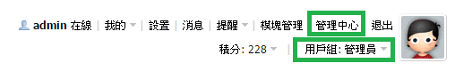
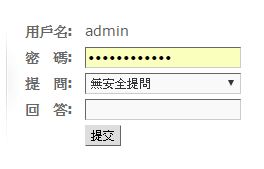
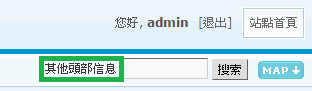
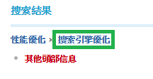
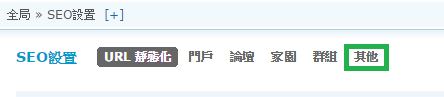
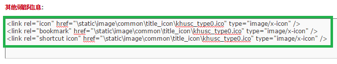

# **
Discuz論壇 Icon**

---

<ol><h4>
  <li>以管理員身份登入，點選【管理中心】
   
  <li>在管理中心登入頁輸入管理員密碼
   
  <li>右邊有個搜尋輸入框，輸入【其他頭部信息】，按【搜索】
   
  <li>在搜索結果中點選【搜索引擎優化】
   
  <li>點選SEO設置中的【其它】
   
  <li>在【其他頭部信息】中輸入以下代碼，【圖片位置】則寫上伺服器中圖片與index.php的相對位置 
    <ul>
      <li><link rel="icon" href="圖片位置" type="image/x-icon" />
      <li><link rel="bookmark" href="圖片位置" type="image/x-icon" />
      <li><link rel="shortcut icon" href="圖片位置" type="image/x-icon" />
    </ul>
   
</h4></ol>

