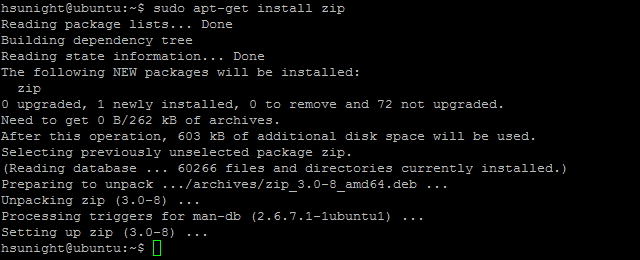

# **<center>備份 會員頭像</center>**

---

#### 1. 使用putty登入伺服器


#### 2. 安裝zip
### ```sudo apt-get install zip```


#### 3. 建立一個備份用的資料夾管理備份
### ```mkdir bkup```


#### 4. 接著把專門放人物頭像的目錄壓縮成zip放進bkup資料夾
#### （記得用日期命名來管理備份內容）
### ```sudo zip -r bkup/avatar151211.zip /var/www/html/uc_server/data/avatar```
