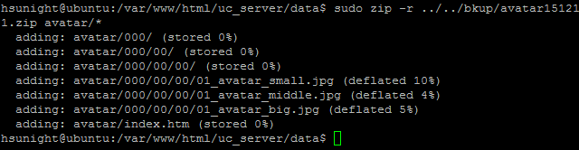

# **<center>備份 會員頭像</center>**

---

#### 1. 使用putty登入伺服器


#### 2. 安裝zip
### ```sudo apt-get install zip```


#### 3. 在伺服器目錄建立一個備份用的資料夾管理備份
### ```sudo mkdir /var/www/html/bkup```


#### 4. 切換到專門放人物頭像的目錄
### ```cd /var/www/html/uc_server/data/avatar/```


#### 5. 接著把專門放人物頭像的目錄壓縮成zip放進bkup資料夾
#### （記得用日期命名來管理備份內容，論壇愈大壓縮時間越長）
### ```sudo zip -r ../../../bkup/avatar15-12-11.zip *```


#### 6. 之後需要還原會員頭像時只要把裡面的【000】資料夾、index.htm