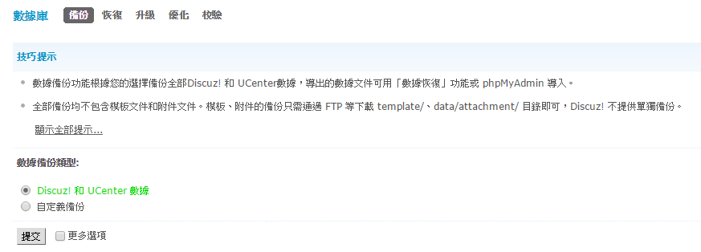
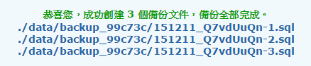

# **
備份 後台設定**

---

#### 1. 登入管理者admin帳號右上角進入【管理中心】

#### 2. 上排分類中選擇【站長】

#### 3. 左排功能中選擇【數據庫】

#### 4. 進入數據庫的頁面後選擇第一個【Discuz! 和 UCenter 數據】按下提交

#### 5. 接著Discuz會自動備份論壇中的大部分設定（不包含附件檔案、圖片等較大資料）

#### 6. 完成後正常來說檔案會在/var/www/html/data/目錄底下

#### 7. 需要還原請從【還原 後台設定】參考還原的方式