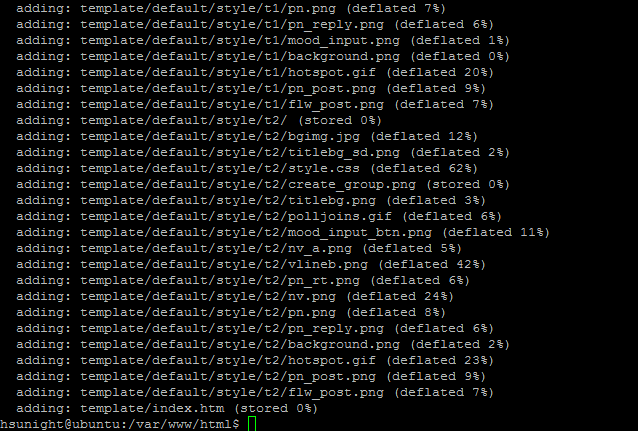

# **<center>備份 論壇模版</center>**

---

#### 1. 使用putty登入伺服器（已完成請往下一步）


#### 2. 安裝zip（已完成請往下一步）
### ```sudo apt-get install zip```


#### 3. 在伺服器目錄建立一個備份用的資料夾管理備份（已完成請往下一步）
### ```sudo mkdir /var/www/html/bkup```


#### 4. 切換到專門放論壇樣版的前一個目錄
### ```cd /var/www/html/```


#### 5. 接著把專門附件檔案的目錄壓縮成zip放進bkup資料夾
#### （記得用日期命名來管理備份內容，論壇愈大壓縮時間越長）
### ```sudo zip -r bkup/template151211.zip template/*```


#### 6. 之後需要還原附件檔案時只要把這個zip解壓縮替換到伺服器目錄就可以了！

#### ※論壇模版通常不會一直改變，不需要和其他備份一樣頻繁。