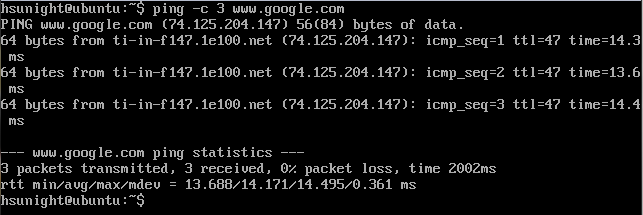
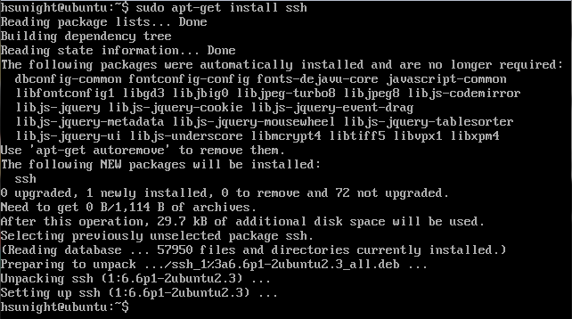
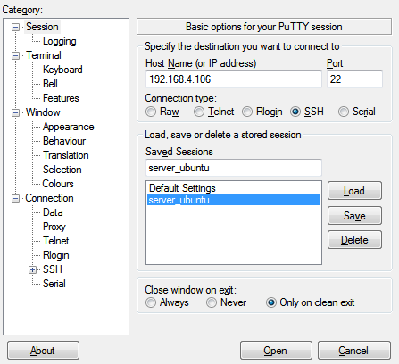
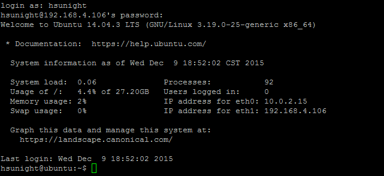

# **安裝lamp & phpmyadmin**


### 1. 確認網路狀態
## ```ping -c 3 www.google.com```


### 2. 安裝ssh
## ```sudo apt-get install ssh```


### 3. 透過ifconfig eth0或eth1取得虛擬機的IP

## ```ifconfig eth1```


### 4. 從本機開啟putty進入server，第一次會出現警告按ok即可


### 5. 登入後將VirtualBox的視窗縮小，用putty操作比較方便


### 6. 安裝lamp
## ```sudo tasksel install lampserver```