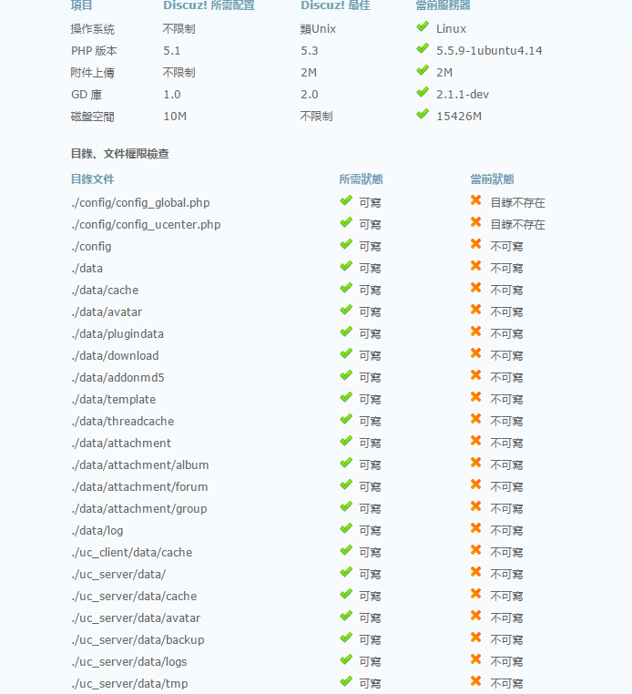
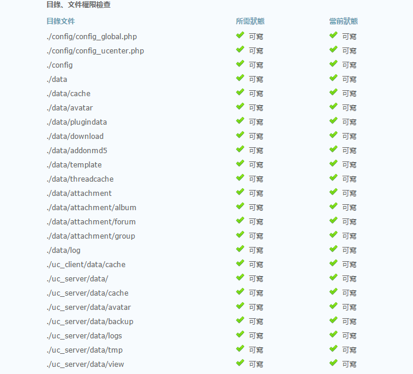

# **安裝 Discuz**

### 1. 下載Discuz安裝包
## ```wget 'http://download.comsenz.com/DiscuzX/3.1/Discuz_X3.1_TC_UTF8.zip'```


### 2. 查詢目前目錄底下是否有Discuz的壓縮檔
## ```ls```


### 3. 安裝unzip（為了對zip壓縮檔解壓縮）
## ```sudo apt-get install unzip```


### 4. 解壓縮Discuz_X3.1_TC_UTF8.zip
## ```sudo unzip Discuz_X3.1_TC_UTF8.zip```

### 5. 再次查詢目前目錄底下應該多三個資料夾(readme、upload、utility)
### （可以在自己本機端也下載一個Discuz_X3.1_TC_UTF8.zip比對內容比較清楚）
## ```ls```


### 6. 將upload資料夾內的所有檔案移動到伺服器的資料夾中
## ```sudo mv upload/* /var/www/html/```

### 7. 回到本機chrome進入(虛擬機IP/install)就會看到Discuz安裝畫面(按我同意)


### 8. 接著如果看到目錄文件權限不足，就需要回到putty將資料夾的權限打開才能繼續安裝，沒有出現錯誤請從(1.)繼續往下


### 9. 先將目錄切換到伺服器的資料夾底下
## ```cd /var/www/html/```


### 10. 修改以下幾個目錄的權限(config、data、uc_server/data/、uc_client/data/cache)
## ```sudo chmod -R 777 config/ data/ uc_server/data/ uc_client/data/cache/```


### 11. 重新整理本機的chrome應該所有狀態都呈現打勾，就能拉到底部按下一步了


### 12. 選擇全新安裝 Discuz! X (含 UCenter Server) 下一步


### 13. 填寫數據庫信息的部分需要修改數據庫密碼(輸入MySQL的root密碼)，填寫管理員信息的部分需要輸入管理員密碼、重複密碼(管理員密碼)，完成後按下一步


### 14. 等待安裝ing…


### 15. 安裝完成後點右下角有一行像是廣告的小字…(您的論壇已完成安裝，點此訪問)
