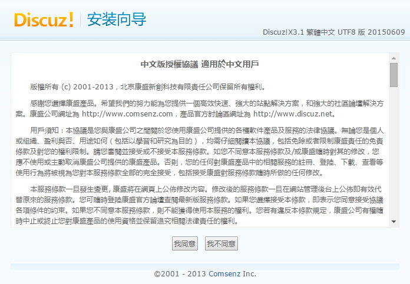

# **安裝 Discuz**

### 1. 下載Discuz安裝包
## ```wget 'http://download.comsenz.com/DiscuzX/3.1/Discuz_X3.1_TC_UTF8.zip'```


### 2. 查詢目前目錄底下是否有Discuz的壓縮檔
## ```ls```


### 3. 安裝unzip（為了對zip壓縮檔解壓縮）
## ```sudo apt-get install unzip```


### 4. 解壓縮Discuz_X3.1_TC_UTF8.zip
## ```sudo unzip Discuz_X3.1_TC_UTF8.zip```

### 5. 再次查詢目前目錄底下應該多三個資料夾(readme、upload、utility)
### （可以在自己本機端也下載一個Discuz_X3.1_TC_UTF8.zip比對內容比較清楚）
## ```ls```


### 6. 將upload資料夾內的所有檔案移動到伺服器的資料夾中
## ```sudo mv upload/* /var/www/html/```

### 7. 回到本機chrome進入(虛擬機IP/install)就會看到Discuz安裝畫面(按我同意)


### 8. 接著會看到目錄文件權限不足所以需要回到putty將資料夾的權限打開才能繼續安裝


### 9. 先將目錄切換到伺服器的資料夾底下
## ```cd /var/www/html/```


