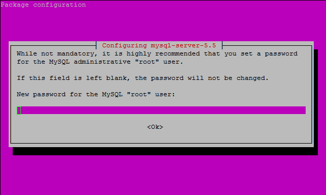

# **<center>安裝 lamp-server</center>**

---

1. 確認網路狀態（ping不到google請檢查網路設定）
#### ```ping -c 3 www.google.com```


1. #### 安裝ssh（為了在虛擬機以外的機器進行操作）
#### ```sudo apt-get install ssh```

1. 透過ifconfig eth0或eth1取得虛擬機的IP
#### ```ifconfig eth1```


1. 從本機開啟putty進入server，第一次會出現警告按ok即可


1. 登入後將VirtualBox的虛擬視窗縮小，用putty操作比較方便


1. 安裝lamp-server
#### ```sudo tasksel install lamp-server```

1.. 輸入MySQL的root密碼（一定要記住）


1. 再次輸入root的密碼


1. 等待安裝ing…


1. 安裝完成後，從本機開啟chrome進入從(3.)取得的虛擬機的IP（出現下圖代表lamp已安裝成功）


###接著請跳下一章＞安裝 phpmyadmin