# **安裝 phpmyadmin**

### 1. 安裝phpmyadmin（需要…容量是否要安裝選Y）
## ```sudo apt-get install phpmyadmin```
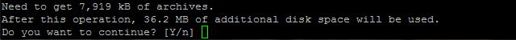

### 2. 選擇Apache2→Ok
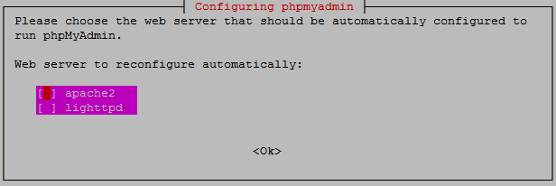

### 3. 選擇Yes
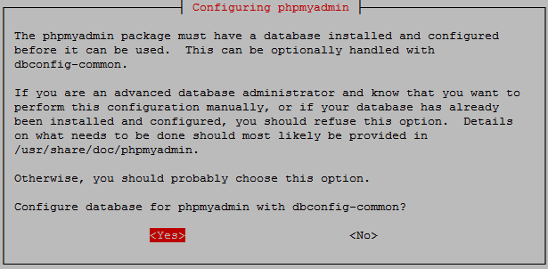

### 4. 輸入在[安裝lamp-server(7.)Mysql的root密碼]
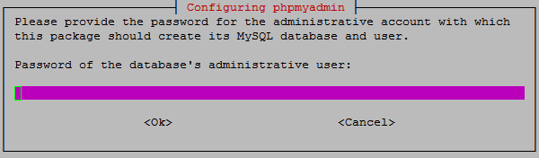

### 5. 再次輸入Mysql的root密碼
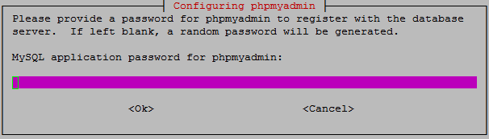

### 6. 最後再次輸入確認Mysql的root密碼
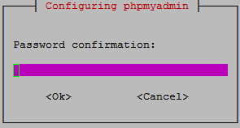

### 7. 最後再次輸入確認Mysql的root密碼


### 8. 安裝完成後，從本機開啟瀏覽器進入(虛擬機IP/phpmyadmin)，會出現404Not Found，因為apache沒有設定到，所以我們需要將phpmyadmin寫入apache的設定中
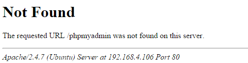

### 9. 使用vim編輯器打開apache的設定檔
##```sudo vim /etc/apache2/apache2.conf```
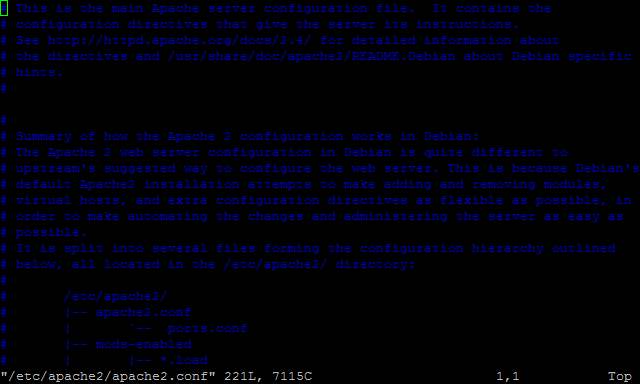

### 10. 將要設定的phpmyadmin設定檔路徑貼上(右鍵)並儲存(:wq)
##```設定檔路徑```
##```(Enter)→(右鍵)→(Esc)→(:wq)```
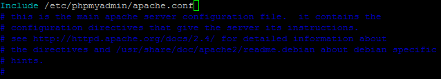

### 11. 重新啟動apache（為了讓apache讀取剛剛修改的內容）
##```sudo service apache2 restart```
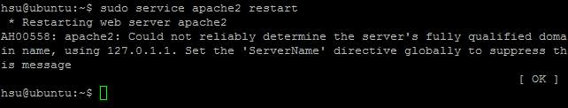


### 1. 再次從本機開啟瀏覽器進入(虛擬機IP/phpmyadmin)
###（出現下圖代表phpmyadmin已安裝成功）
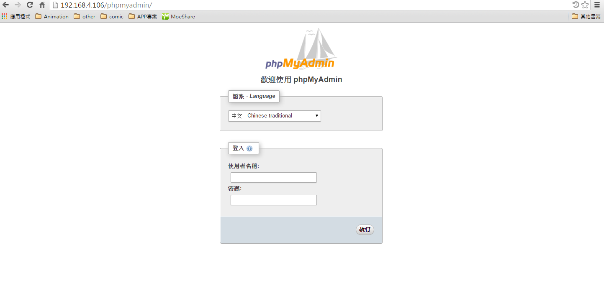

###接著請跳下一章＞[安裝 Discuz](../install/inst_discuz.md)

參考資料：
[How to solve the phpmyadmin not found issue after upgrading php and apache?](http://askubuntu.com/questions/387062/how-to-solve-the-phpmyadmin-not-found-issue-after-upgrading-php-and-apache)