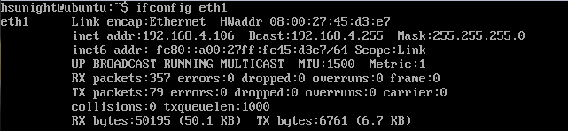

# **安裝lamp & phpmyadmin**


### 1. 確認網路狀態

## ```ping -c 3 www.google.com```


### 2. 安裝 openssh

## ```sudo apt-get install openssh```

### 3. 透過 ifconfig eth0 或 eth1 取得虛擬機的IP

## ```ifconfig eth1```


### 4. 從本機開啟 putty 進入 Linux server


