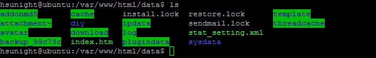
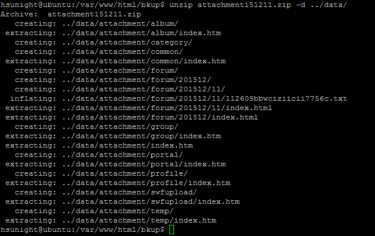

# **<center>還原 附件檔案</center>**

---

#### 1. 使用putty登入伺服器（已完成請往下一步）


#### 2. 切換到專門放附件檔案的前一個目錄
### ```cd /var/www/html/data/```


#### 3. 確定一次data目錄底下是否有avatar這個目錄
### ```ls```


#### 4. 修改attachment目錄名稱（不建議直接砍掉目錄，留著失敗了還能還原）
### ```sudo mv attachment attachment~```


#### 5. 確定attachment目錄名稱是否修改為attachment~了
### ```ls```


#### 6. 切換到bkup目錄
### ```cd ../bkup```


#### 7. 解壓縮之前在【備份 後台設定】建立的attachment年月日.zip到data目錄底下
### ```unzip attachment151211.zip -d ../data/```


#### 8. 重新整理論壇，附件檔案應該可以下載了！