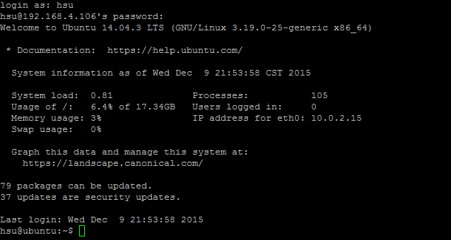
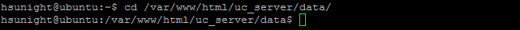
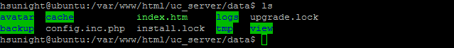
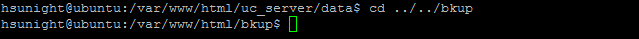
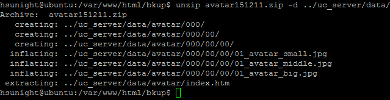

# **<center>還原 會員頭像</center>**

---

#### 1. 使用putty登入伺服器（已完成請往下一步）


#### 2. 切換到專門放會員頭像的前一個目錄
### ```cd /var/www/html/uc_server/data/```


#### 3. 確定一次目錄底下是否有avatar這個目錄
### ```ls```


#### 4. 修改avatar目錄名稱（不建議直接砍掉目錄，留著失敗了還能還原）
### ```sudo mv avatar avatar~```


#### 5. 確定avatar目錄名稱是否修改為avatar~了
### ```ls```


#### 6. 切換到bkup目錄
### ```cd ../../bkup```


#### 7. 解壓縮之前在【備份 後台設定】建立的avatar年月日.zip到data目錄底下
### ```unzip avatar151211.zip -d ../uc_server/data/```


#### 8. 重新整理論壇，會員頭像應該可以顯示了！