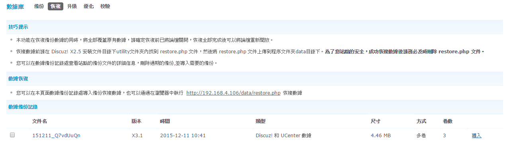
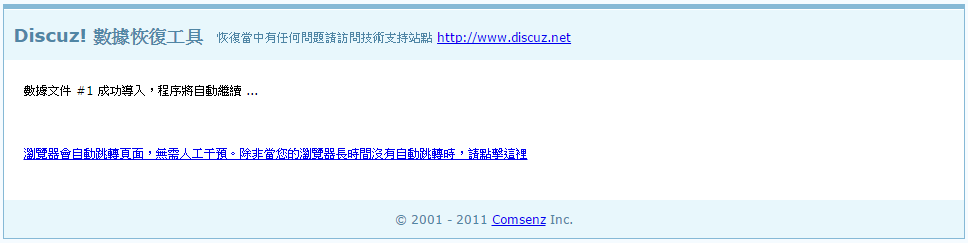
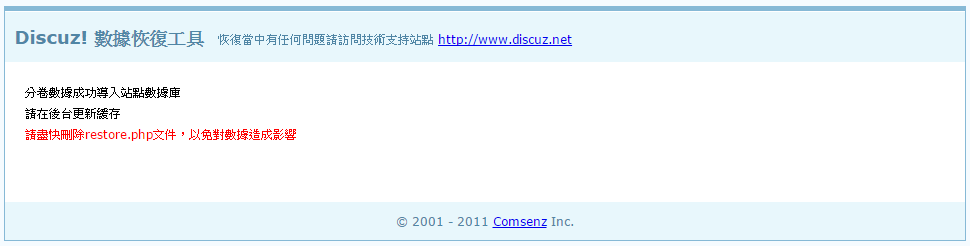

# **<center>還原 本機</center>**

---

#### 1. 使用putty登入伺服器(已完成請往下一步)


#### 2. 將還原程序放入/var/www/html/data/中
### ```sudo mv utility/restore.php /var/www/html/data/```


#### 3. 從本機chrome登入管理者admin帳號右上角進入【管理中心】


#### 4. 上排分類中選擇【站長】


#### 5. 左排功能中選擇【數據庫】


#### 6. 選擇數據庫頁面上排的【恢復】，指定以前備份過的後台設定，按導入


#### 7. 等待導入ing…


#### 8. 完成導入


#### 9. 刪除還原程序
### ```sudo rm -rf /var/www/html/data/restore.php```
