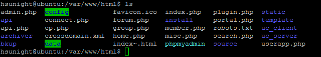
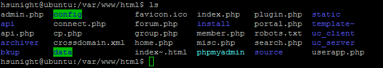
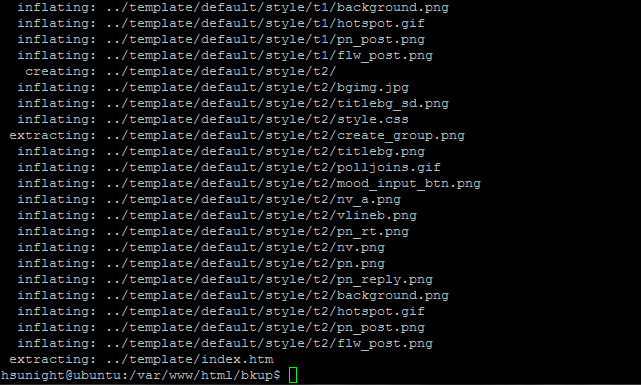

# **<center>還原 論壇模版</center>**

---

#### 1. 使用putty登入伺服器（已完成請往下一步）


#### 2. 切換到專門放附件檔案的前一個目錄
### ```cd /var/www/html/```


#### 3. 確定一次目錄底下是否有template這個目錄
### ```ls```


#### 4. 修改template目錄名稱（不建議直接砍掉目錄，留著失敗了還能還原）
### ```sudo mv template template~```


#### 5. 確定attachment目錄名稱是否修改為attachment~了
### ```ls```


#### 6. 切換到bkup目錄
### ```cd bkup/```


#### 7. 解壓縮之前在【備份 論壇模版】建立的template年月日.zip到data目錄底下
### ```sudo unzip template151211.zip -d ../```


#### 8. 重新整理論壇，至管理員的管理中心/風格管理應該可以看到還原的樣版了！

### **<center>以上就是在Linux中還原Discuz的教學！**
### **<center>Thanks for watching！**