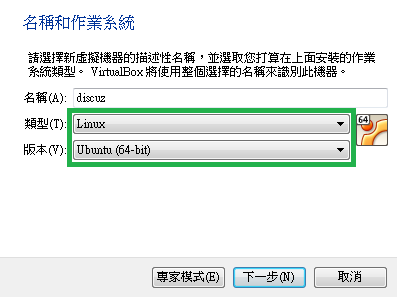
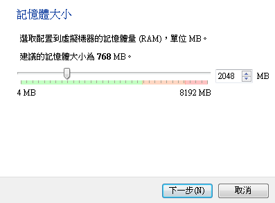
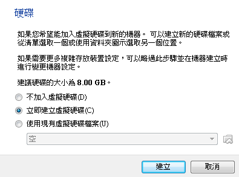
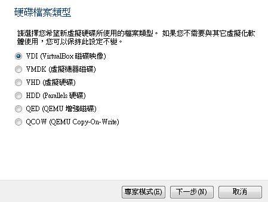
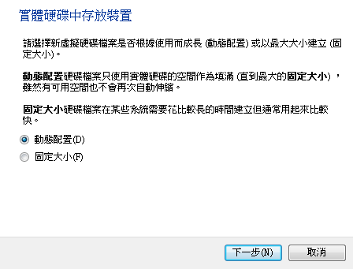
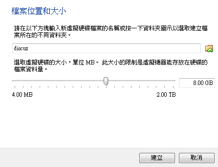
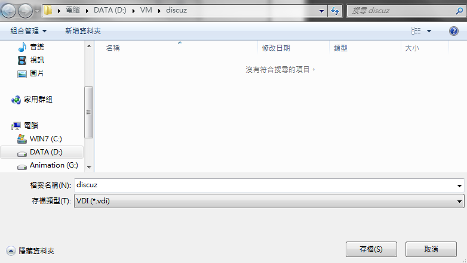
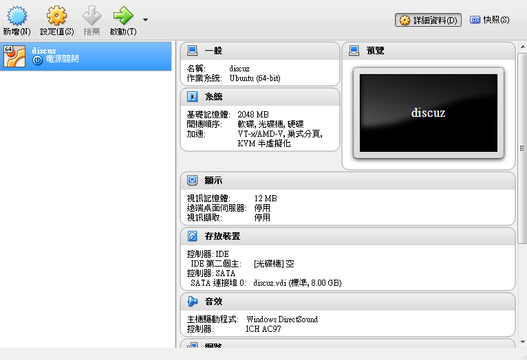

# **
虛擬機建立**

---

<ol>
  <li>開啟VirualBox，點選<b>新增</b>
   
  <li>輸入要建立的虛擬機資訊，輸入完成後按下一步
    <ul>
      <li>名稱（虛擬機名稱）：discuz
      <li>類型（虛擬機系統類型）：Linux
      <li>版本（虛擬機系統版本）：Ubuntu(64-bit)
    </ul>
     
  <li>選擇要給需擬機的記憶體大小，建議2048MB
   
  <li>選擇立即建立虛擬硬碟
   
  <li>
   
  <li>
   
  <li>
   
  <li>
   
  <li>
   
  <li>
   
</ol>