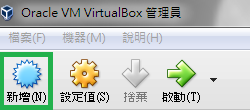
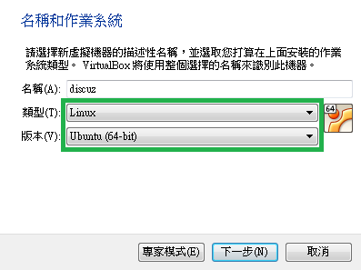
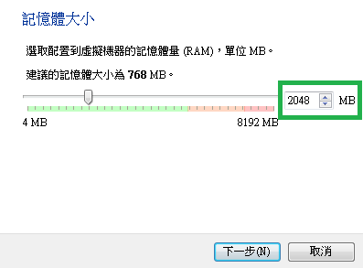
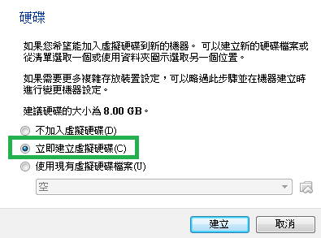
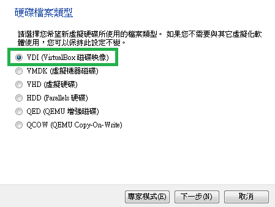
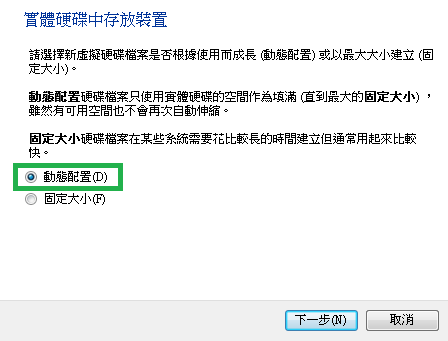
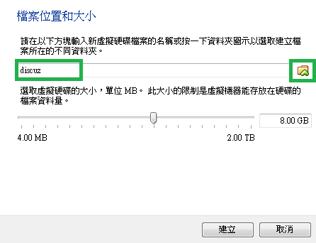
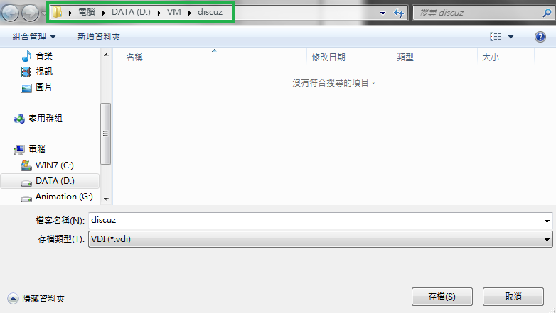
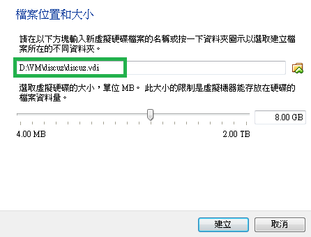
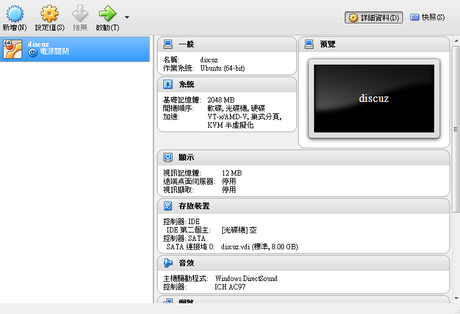

# **
虛擬機建立**

---

<ol>
  <li>開啟VirualBox，點選<b>新增</b>
   
  <li>輸入要建立的虛擬機資訊，輸入完成後按下一步
    <ul>
      <li>名稱（虛擬機名稱）：discuz
      <li>類型（虛擬機系統類型）：Linux
      <li>版本（虛擬機系統版本）：Ubuntu(64-bit)
    </ul>
     
  <li>選擇要給需擬機的記憶體大小，建議2048MB，輸入完成後按下一步
   
  <li>選擇【立即建立虛擬硬碟】，輸入完成後按下一步
   
  <li>選擇【VDI(VirtualBox 磁碟映像)】，輸入完成後按下一步
   
  <li>選擇【動態配置】，輸入完成後按下一步
   
  <li>修改虛擬機的存放位置，點右邊的資料夾修改路徑
   
  <li>選擇要存放的位置，教學中放在D:底下自己建立的discuz資料夾中，選好後按下存檔
   
  <li>按建立
   
  <li>新增底下清單應該會多一個虛擬機名為discuz
   
</ol>

###接著請跳下一章＞虛擬機設定