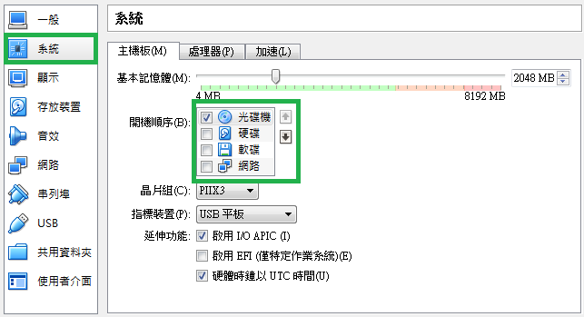

# **
虛擬機設定**

---

<ol><h4>
  <li>點選剛剛建立好的discuz虛擬機右鍵，點選設定值
   
  <li>點選【系統】，調整開機順序如下圖
   
  <li>點選【存放裝置】，點選控制器:IDE底下【空的光碟圖示】，點選右邊光碟【選擇虛擬光碟檔案】
   
  <li>選擇【ubuntu-14.04.3-server-amd64】，按下【開啟舊檔】
   
  <li>檢查檔案是否已經匯入
   
  <li>點選【網路】，附加到：選擇【橋接界面卡】，按下【確認】完成設定
   
</h4></ol>

###接著請跳下一章＞安裝