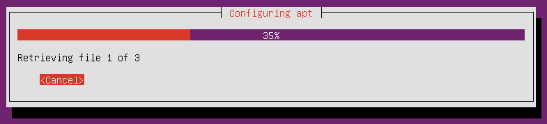

# **
安裝 Ubuntu Server**

---

<ol><h4>
  <li>點選【虛擬機建立】建立的虛擬機，啟動
   
  <li>選擇系統語言，按【Enter】
   
  <li>選擇Install Ubuntu Server，按【Enter】
   
  <li>選擇安裝時界面出現的語言，按【Enter】
   
  <li>按【Enter】
   
  <li>按【Enter】
   
  <li>按【Enter】
   
  <li>按【Enter】
   
  <li>等待安裝中
   
  <li>按【Enter】
   
  <li>輸入root使用者名稱，本測試使用【hsu】，按【Enter】
   
  <li>輸入使用者名稱，本測試使用【hsu】，按【Enter】
   
  <li>輸入使用者密碼，本測試使用【a0128338】，按【Enter】
   
  <li>再次輸入使用者密碼，按【Enter】
   
  <li>按【Enter】
   
  <li>等待安裝中
   
  <li>按【Enter】
   
  <li>按【Enter】
   
  <li>按【Enter】
   
  <li>選擇【Yes】，按【Enter】
   
  <li>按【Enter】
   
  <li>選擇【Yes】，按【Enter】
   
  <li>等待安裝中
   
  <li>按【Enter】
   
  <li>等待安裝中
   
  <li>等待安裝中
   
  <li>按【Enter】
   
  <li>按【Enter】
   
  <li>選擇【Yes】，按【Enter】
   
  <li>按【Enter】
   
  <li>安裝完成重新啟動後會出現這個畫面
   
  <li>點選視窗左上角【檔案】，按【關閉】
   
  <li>選擇【機器關機】，按【確定】
   
  <li>回到VirtualBox設定畫面，選擇【存放裝置】，修改開機順序如下圖
   
  <li>再次開啟discuz虛擬機即可看到登入畫面
    <ul>
      <li>ubuntu login：本測試使用【hsu】(12)
      <li>password：本測試使用【a0128338】(13)
    </ul>
   
  <li>輸入成功就能登入ubuntu server了！
     
</h4></ol>

### **
以上就是在VirtualBox中安裝虛擬機的教學！**
### **
Thanks for watching！**